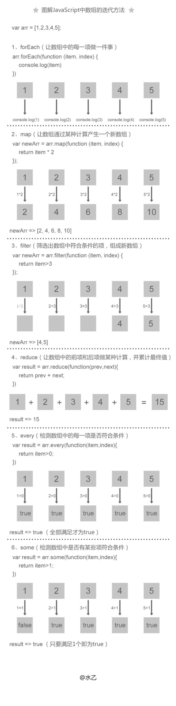

# JavaScript 框架

## 设计图

## 补充

| 功能              | 参考                                       |      |
| --------------- | ---------------------------------------- | ---- |
| 生成兼容 RFC 的 UUID | https://github.com/broofa/node-uuid      |      |
|                 | https://github.com/TingGe/knowledge/blob/master/javascript/others/javascript.algorithms/Math.uuid.js |      |
|                 |                                          |      |
|                 |                                          |      |

## 知识点

